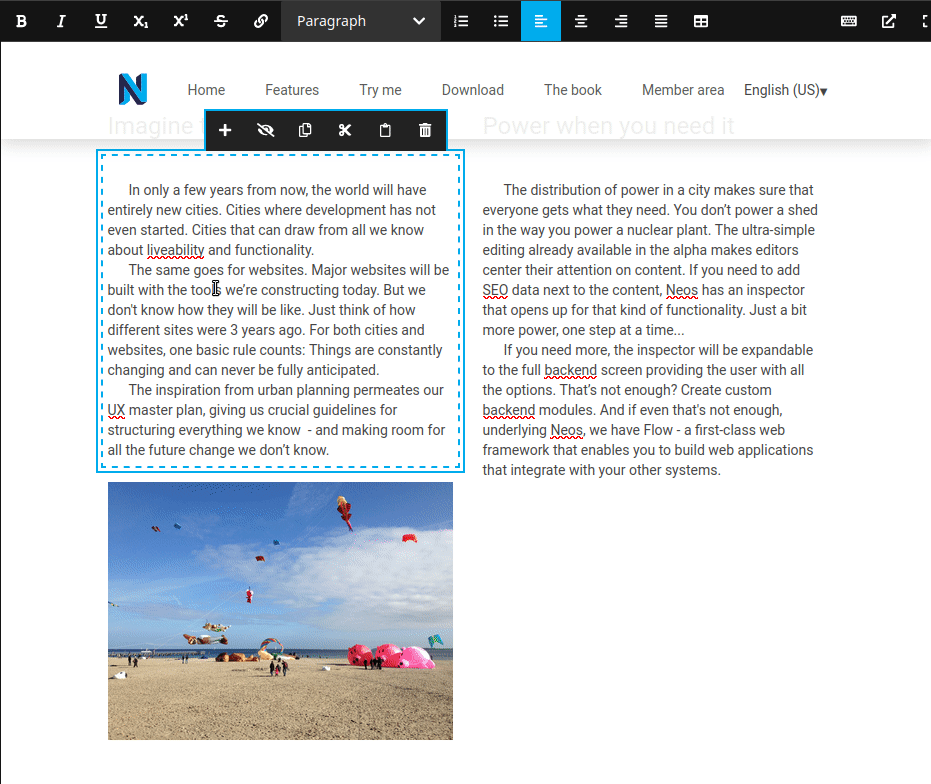
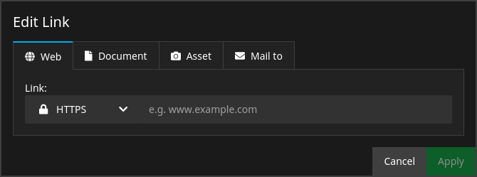
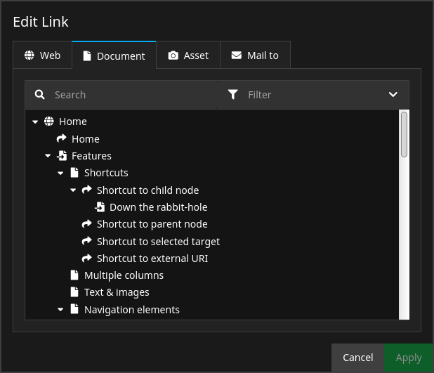
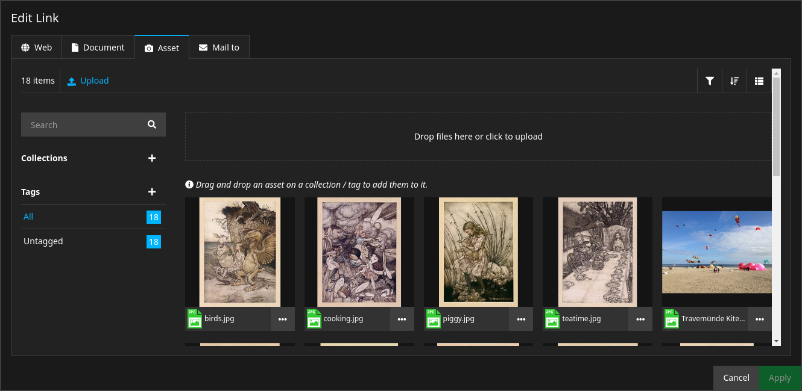

# Sitegeist.Archaeopteryx

> The missing link editor for Neos

<p align="center">
  
</p>

<p align="center">
  
</p>

### Authors & Sponsors

* Wilhelm Behncke - behncke@sitegeist.de
* Martin Ficzel - ficzel@sitegeist.de

*The development and the public-releases of this package was generously sponsored
by our customer [https://www.cornelsen.de](https://www.cornelsen.de) and our employer [https://www.sitegeist.de](https://www.sitegeist.de).*

## Installation

```bash
composer require sitegeist/archaeopteryx
```

## Links in Rich Text

<p align="center">
  
</p>

Sitegeist.Archaeopteryx is a drop-in replacement for the default Link Editor that is used for Rich Text in Neos. Once installed, you'll notice that the default editor won't show up anymore if you try to add a link to some piece of text.

Instead, a dialog with a lot more options will open:

<p align="center">
  
</p>

Sitegeist.Archaeopteryx is fully backwards-compatible. You don't have to worry about links that are already in the system. You can install or uninstall Sitegeist.Archaeopteryx at any point in time while retaining full functionality of all of your links.

## Link in Inspector properties

<table align="center">
  <tbody>
    <tr>
      <td rowspan="2">
        
      </td>
      <td>
        
      </td>
    </tr>
    <tr>
      <td>
        
      </td>
    </tr>
  </tbody>
</table>

Besides the integration with the Rich Text editor toolbar, Sitegeist.Archaeopteryx also provides an Inspector Editor that can be used as a replacement for `Neos.Neos/Inspector/Editors/LinkEditor`.

In case of the Inspector Editor, Sitegeist.Archaeopteryx won't automatically override the default. Instead, you need to configure it as a properties' inspector editor explicitly:

```yaml
'Vendor.Site:MyContent':
  # ...
  properties:
    link:
      type: string
      ui:
        inspector:
          # ...
          editor: 'Sitegeist.Archaeopteryx/Inspector/Editors/LinkEditor'
```

## Link Types

Sitegeist.Archaeopteryx ships with 4 built-in Link Types.

### Web

<p align="center">
  
</p>

The `Web` Link Type handles external links, so links that begin with `http://` or `https://`.

### Document

<p align="center">
  
</p>

The `Document` Link Type handles internal links. The editor offers you a document tree from which you can select documents from within your site. It also offers a search and a node type filter similar to the main document tree in the left side bar of the Neos UI.

The `Document` Link Type can be configured as follows:

**RTE Configuration:**

```yaml
'Vendor.Site:MyAwesomeNodeTypeWithSomeRichText':
  # ...
  properties:
    text:
      type: string
      ui:
        inlineEditable: true
        inline:
          editorOptions:
            # ..
            linking:
              #
              # Sitegeist.Archaeopteryx will consider the
              # startingPoint option in the linking
              # section of the RTE configuration.
              #
              # However, the startingPoint option of the
              # extra key 'Sitegeist.Archaeopteryx' from
              # below takes precedence.
              #
              startingPoint: '/sites/vendor-site/node-2ohiwg6ardhhf'
              'Sitegeist.Archaeopteryx':
                linkTypes:
                  'Sitegeist.Archaeopteryx:Node':
                    startingPoint: '/sites/vendor-site/node-40up2e13w4fd9' # Default: current site node
                    baseNodeType: 'Vendor.Site' # default: Neos.Neos:Document
                    loadingDepth: 8 # default: 4
                    allowedNodeTypes: ['Vendor.Site:Mixin.ReferenceableDocument'] # a list of allowed linkable node types or super types
```

**Inspector Editor Configuration:**

```yaml
'Vendor.Site:MyAwesomeNodeTypeWithALinkProperty':
  # ...
  properties:
    link:
      type: string
      ui:
        inspector:
          # ...
          editor: 'Sitegeist.Archaeopteryx/Inspector/Editors/LinkEditor'
          editorOptions:
            linkTypes:
              'Sitegeist.Archaeopteryx:Node':
                startingPoint: '/sites/vendor-site/node-40up2e13w4fd9' # Default: current site node
                baseNodeType: 'Vendor.Site' # default: Neos.Neos:Document
                loadingDepth: 8 # default: 4
                allowedNodeTypes: ['Vendor.Site:Mixin.ReferenceableDocument',] # a list of allowed linkable node types or super types
```

### Asset

<p align="center">
  
</p>

The `Asset` Link Type handles links to files from the Media Module. The editor will offer you a media browser from which you can select any asset from within your site.

### Mail To

<p align="center">
  
</p>

The `Mail To` Link Type handles e-mail links, so links that start with `mailto:`. Links with the `mailto:` protocol allow not only to specify a recipient, but also to configure a subject, a message body, carbon copy (CC) recipients and blind carbon copy (BCC) recipients for the outgoing e-mail.

The editor for the `Mail To` Link Type will offer all of those fields. Each field can be deactivated via configuration.

The `Mail To` Link Type can be configured as follows:

**RTE Configuration:**

```yaml
'Vendor.Site:MyAwesomeNodeTypeWithSomeRichText':
  # ...
  properties:
    text:
      type: string
      ui:
        inlineEditable: true
        inline:
          editorOptions:
            # ..
            linking:
              'Sitegeist.Archaeopteryx':
                linkTypes:
                  'Sitegeist.Archaeopteryx:MailTo':
                    enabledFields:
                      subject: true
                      cc: true
                      bcc: true
                      body: true
```

**Inspector Editor Configuration:**

```yaml
'Vendor.Site:MyAwesomeNodeTypeWithALinkProperty':
  # ...
  properties:
    link:
      type: string
      ui:
        inspector:
          # ...
          editor: 'Sitegeist.Archaeopteryx/Inspector/Editors/LinkEditor'
          editorOptions:
            linkTypes:
              'Sitegeist.Archaeopteryx:MailTo':
                enabledFields:
                  subject: true
                  cc: true
                  bcc: true
                  body: true
```

### Phone Number

<p align="center">
  
</p>

The `Phone Number` link type handles phone links, which start with `tel:` and allow to start a call. In the editor one selects the country calling code and add the rest of the phone number via an input field. To make it easier to check the added phone number, it is auto formatted  in the preview according to the selected country. Via the the node type configuration you can define a `defaultCountry` and an array of `favoredCountries`. The `defaultCountry` is used to prefill the country calling code for new links. The values from the `favoredCountries` array are used to define a list of preferred countries, which will be placed at the top of the selectable country calling codes in the editor. The used values are ISO 3166-1 alpha-2 ([wikipedia](https://en.wikipedia.org/wiki/ISO_3166-1_alpha-2)) country codes. Both configuration settings are placed in the `linking` respectively `linkTypes` section of the `editorOptions`:

```yaml
'Vendor.Site:MyAwesomeNodeTypeWithSomeRichText':
  # ...
  properties:
    text:
      type: string
      ui:
        inlineEditable: true
        inline:
          editorOptions:
            # ..
            linking:
              'Sitegeist.Archaeopteryx':
                linkTypes:
                  'Sitegeist.Archaeopteryx:PhoneNumber':
                    defaultCountry: FR
                    favoredCountries:
                      - DE
                      - AT
                      - CH
                      - FR
```

```yaml
'Vendor.Site:MyAwesomeNodeTypeWithALinkProperty':
  # ...
  properties:
    link:
      type: string
      ui:
        inspector:
          # ...
          editor: 'Sitegeist.Archaeopteryx/Inspector/Editors/LinkEditor'
          editorOptions:
            linkTypes:
              'Sitegeist.Archaeopteryx:PhoneNumber':
                defaultCountry: FR
                favoredCountries:
                  - DE
                  - AT
                  - CH
                  - FR
```

## Link Options

<p align="center">
  
</p>

In RTE context, Sitegeist.Archaeopteryx allows you to set some additional link options. These are:

* **Anchor:** This will add a string to the hash-section of the URL (the part after `#`)
* **Title:** This will set the `title` attribute of the resulting `<a>`-Tag
* **Open in new window:** This will set the `target` attribute of the resulting `<a>`-Tag to `_blank`
* **rel="nofollow":** This will set the `rel` attribute of the resulting `<a>`-Tag to `nofollow`

Not all Link Types support all of these options however. Here's an overview of what Link Type supports which options:

| Link Type     | Supported Link Options                              |
| ------------- | --------------------------------------------------- |
| Web           | Anchor, Title, Open in new window, `rel="nofollow"` |
| Document      | Anchor, Title, Open in new window, `rel="nofollow"` |
| Asset         | Title, Open in new window, `rel="nofollow"`         |
| Mail To       | - none -                                            |

To enable or disable certain Link Options generally, you can use the `linking` section of your RTE configuration:

```yaml
'Vendor.Site:MyAwesomeNodeTypeWithSomeRichText':
  # ...
  properties:
    text:
      type: string
      ui:
        inlineEditable: true
        inline:
          editorOptions:
            # ..
            linking:
              anchor: true
              title: true
              relNofollow: true
              targetBlank: true
```

## Disabling Link Type Editors

It is possible to disable one or more link type editors via the configuration for the inspector as well as for inline editable content elements. To achieve this, you use the `enabled` key for the specific link type editor in the `linkTypes` section. The default for this key is `true`.

### RTE Configuration

```yaml
'Vendor.Site:MyAwesomeNodeTypeWithSomeRichText':
  # ...
  properties:
    text:
      type: string
      ui:
        inlineEditable: true
        inline:
          editorOptions:
            # ..
            linking:
              'Sitegeist.Archaeopteryx':
                linkTypes:
                  'Sitegeist.Archaeopteryx:MailTo':
                    enabled: false
```

### Inspector Editor Configuration

```yaml
'Vendor.Site:MyAwesomeNodeTypeWithALinkProperty':
  # ...
  properties:
    link:
      type: string
      ui:
        inspector:
          # ...
          editor: 'Sitegeist.Archaeopteryx/Inspector/Editors/LinkEditor'
          editorOptions:
            linkTypes:
              'Sitegeist.Archaeopteryx:MailTo':
                enabled: false
```

## Contribution

We will gladly accept contributions. Please send us pull requests.

## LICENSE

see [LICENSE](./LICENSE)
